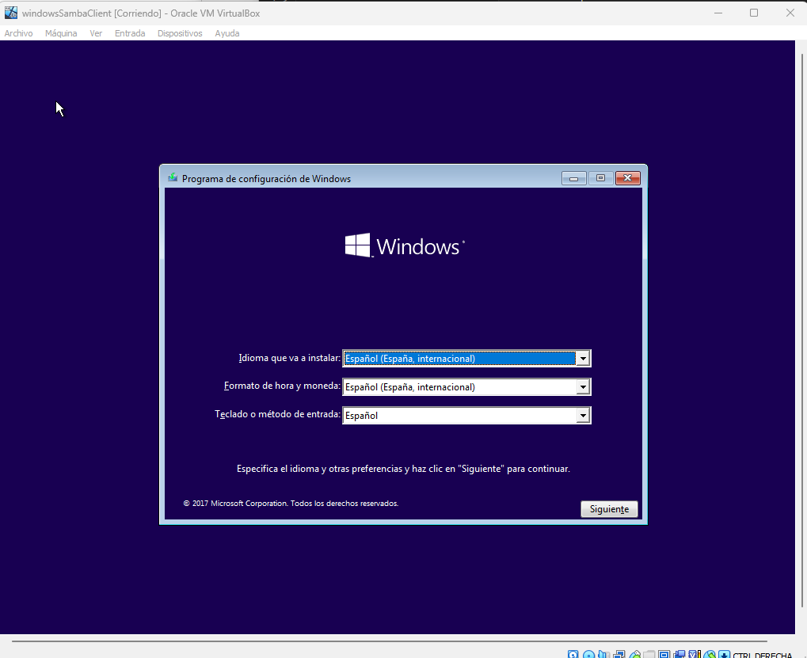

# Actividade 6.1 - Integración de equipos Windows en Samba AD con Ubuntu Server

Índice
- Configuración máquinas
- Unir el cliente windowsSambaClient al dominio
- Acceso a recursos compartidos desde nuestro cliente Windows
- Segmentar la red con VLANs

## Configuración máquinas
### Instalación máquina windows cliente Samba
Creamos una nueva máquina en VBox a la que vamos a llamar *windowsSambaClient*  
  

Instalamos el sistema operativo Windows 10

  

Una vez windows 10 esta instalado en la máquina le damos a esta configuración de red con un IP fija dentro de la misma red en la que se encuentra el servidor y el otro cliente samba *ubuntuClient*.  
  
  
Le cambiamos el nombre al equipo por uno más intuitivo, en este caso *pc1*  
  

## Unir el cliente windowsSambaClient al dominio 
Comprobamos como desde el cliente resuelve para lcmaso.local 
  

Unimos el cliente al dominio  
  

Introducimos las credenciales de administrador de samba y comprobamos que se une el cliente correctamente  
  

Reiniciamos el equipo 

Accedemos a la máquina con un usuario de dominio  
   
   

## Acceso a recursos compartidos desde nuestro cliente Windows
Para que el cliente pueda acceder a los recursos compartidos generados en la práctica anterior creamos en el servidor un directorio /nas/ y movemos ahí las carpetas compartidas: g1, g2, g3  
  
Ahora modificamos el archivo smb.conf para ajustar las rutas de los recursos compartidos que hemos movido  
   
Otorgamos permisos de lecto/escritura a los correspondientes recursos   
~~~
sudo chmod -R 755 /nas
sudo chown -R root:"domain users" /nas
~~~

Comprobamos como podemos acceder a los recursos compartidos  
  

Accedemos con el usuario usu2 y comprobamos las restricciones a las carpetas para este usuario   
  
Comprobamos también como podemos acceder a los recursos compartidos a través del nombre de dominio *usdc.lcmaso.local*
  

## Segmentar la red con VLANs
Para poder segmentar nuestra red con dos VLAN lo primero tenemos que hacer es configurar nuestro servidor como servidor dhcp, para ello primero modificamos la configuración de red en los adaptadores que van a configurar las VLAN.  
  

Instalamos los paquetes necesarios para un servidor *dhcp*
~~~
sudo apt install openvswitch-switch-dpdk
sudo apt install isc-dhcp-server
~~~

Indicamos al servidor dhcp en que interfaces va a funcionar este mediante el archivo */etc/default/isc-dhcp-server*

  

Modificamos el archivo dhcp.conf y definimos las VLAN como subredes   
  
  

Comprobamos el servicio dhcp esta activo  
  

Ahora en los clientes cambiamos la configuración de red fija que les habíamos dado por una automática de forma que nuestro servidor dhcp les de ip  

  
  
Comprobamos como a cada máquina se le asigna una ip perteneciente a las correspondientes subredes de cada VLAN  
  
  

